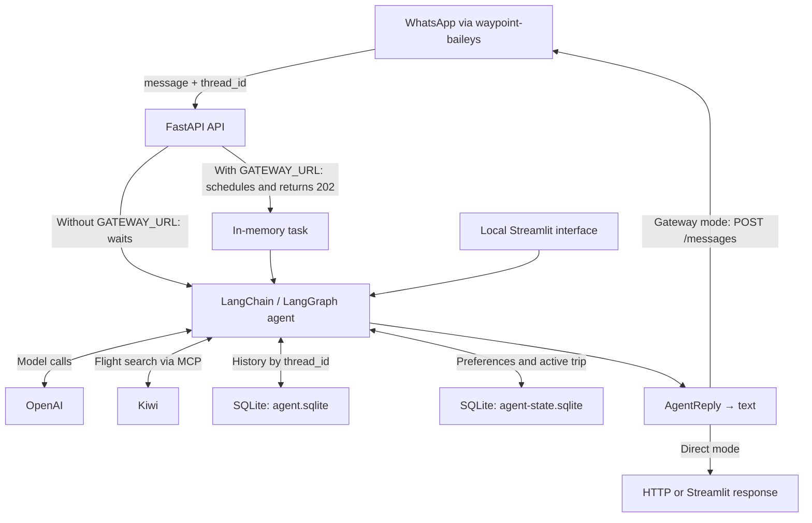

# travel-agent

**English** | [**Português (Brasil)**](README.pt-BR.md)

A flight-search assistant for WhatsApp conversations. Dhay searches Kiwi, compares offers, and replies with prices, routes, and booking links while keeping each conversation's context in SQLite.

This repository contains the agent service and a local Streamlit interface. A separate service, `waypoint-baileys`, connects to WhatsApp. The agent's prompt directs it to reply in Brazilian Portuguese; the local interface mixes English and Portuguese labels. English documentation does not localize the product.

[Start here](#start-here) · [WhatsApp integration](#whatsapp-integration) · [Configuration](#configuration) · [How it works](#how-it-works) · [Data and operations](#data-and-operations) · [Development and verification](#development-and-verification)

## Capabilities

- Search one-way or return flights using fixed dates, date ranges, or a length of stay.
- Present offers with prices, routes, details, and Kiwi booking links.
- Keep preferences and an active trip brief per `thread_id`, alongside conversation history.
- Normalize known destinations such as Bali and Santiago, and filter mismatched arrivals for destinations covered by the resolver.
- Serve HTTP requests directly or send replies back to a WhatsApp gateway in the background.

**Limits:** purchases happen outside the conversation through the offer link. The agent does not reserve flights, issue tickets, collect payments, monitor prices, or provide hotels, visas, or packages. Results depend on Kiwi and the model; this is a proof of concept, not a guarantee of availability or price.

## Start here

### Prerequisites

- Python **3.13 or later** and [uv](https://docs.astral.sh/uv/).
- An OpenAI API key with access to the configured model; model calls may incur charges.
- Network access to OpenAI and `https://mcp.kiwi.com`. The service discovers Kiwi's MCP tools during startup, before accepting requests.

These commands run the source code from the repository root.

### 1. Install and configure

```bash
uv sync
cp .env.example .env
```

Copy the file only if you do not already have a `.env`. Edit it before starting:

- Set `OPENAI_API_KEY`.
- Leave `GATEWAY_URL=` empty to test without WhatsApp. The example contains `http://localhost:3000`, which enables gateway delivery mode.
- Replace `GATEWAY_TOKEN=change-me` with your own secret. Do not expose a service using the example tokens.
- Replace `ADMIN_TOKEN` if you need to delete conversations through the API; leave it empty to disable that operation.

### 2. Start the API

```bash
uv run fastapi dev main.py
```

The API is available at `http://127.0.0.1:8000`; interactive documentation is at `http://127.0.0.1:8000/docs`. Stop it with **Ctrl+C**.

### 3. Send your first message

In another terminal, set `GATEWAY_TOKEN` to the same value as in `.env` — `curl` does not load that file automatically:

```bash
export GATEWAY_TOKEN='replace-with-your-token'
curl --fail-with-body http://127.0.0.1:8000/v1/messages \
  -H "Authorization: Bearer $GATEWAY_TOKEN" \
  -H 'Content-Type: application/json' \
  -d '{"message":"Quero ir de São Paulo, Brasil, a Santiago, Chile, no próximo mês, ficar 7 noites, 1 adulto, econômica. Busque a opção mais barata.","thread_id":"readme-demo"}'
```

The Portuguese sample asks for the cheapest economy return trip from São Paulo, Brazil, to Santiago, Chile, next month, staying seven nights, for one adult. With `GATEWAY_URL` empty, the HTTP response is `200` with `{"messages":"..."}`; `messages` is text, not an array. The agent may return offers or ask for a missing detail. Reuse `readme-demo` to continue the conversation; use another `thread_id` for separate history. Allow time for model and tool calls; the response is not streamed.

### Optional local interface

```bash
uv run streamlit run app.py
```

Open the URL printed by Streamlit, normally `http://localhost:8501`. In **Travel Assistant**, type into **Digite sua pergunta** (enter your question); **Consultando o agente...** means the response is being processed. This interface calls the agent directly, bypassing the API and gateway. Each Streamlit session gets a random `thread_id`; a new session does not automatically recover the previous conversation. Stop it with **Ctrl+C**.

## WhatsApp integration

Set `GATEWAY_URL` to the `waypoint-baileys` service URL and use the same `GATEWAY_TOKEN` in both services.

| Step | Contract |
| --- | --- |
| Gateway input | `POST /v1/messages` with `{"message":"...","thread_id":"<chat JID>"}` |
| Agent acknowledgment | HTTP `202` with `{"ok":true}` when `GATEWAY_URL` is set |
| Reply to gateway | `POST {GATEWAY_URL}/messages` with `{"jid":"<chat JID>","text":"..."}` |
| Authentication | `Authorization: Bearer <GATEWAY_TOKEN>` in both directions |

A `202` confirms only local scheduling, **not delivery**. Tasks live in process memory, without a durable queue; restarting the service can lose pending work. Gateway mode serializes messages per conversation within a single process. Agent errors produce a fallback message; delivery failures are logged. The client retries once on HTTP transport errors or an initial `503` response.

**Security:** without `GATEWAY_TOKEN`, `/v1/messages` is open. The token is shared between services, not per-user authorization for a `thread_id`; keep the API behind a trusted boundary. `/` and `/docs` are not protected by this middleware. The administrative endpoint uses a separate token.

## Configuration

Settings are read from the environment and `.env`; environment variables take precedence. Restart the process after changing them.

| Variable | Code default | Purpose |
| --- | --- | --- |
| `OPENAI_API_KEY` | empty | Credential for OpenAI calls |
| `OPENAI_MODEL` | `gpt-5-mini` | Agent model |
| `OPENAI_REASONING_EFFORT` | `low` | Reasoning effort; accepted values depend on the model |
| `OPENAI_VERBOSITY` | `low` | Verbosity; compatibility depends on the model |
| `GATEWAY_URL` | empty | Empty: direct HTTP reply; set: gateway delivery |
| `GATEWAY_TOKEN` | empty | Shared secret for inbound and outbound gateway requests |
| `ADMIN_TOKEN` | empty | Authorizes conversation deletion; empty: endpoint refuses requests |
| `TIMEZONE` | `America/Sao_Paulo` | Current date and relative-date interpretation in the prompt |
| `SQLITE_PATH` | `data/agent.sqlite` | LangGraph history database; also determines the state database path |

Unlike the empty code defaults, [`.env.example`](.env.example) sets a gateway URL and example tokens.

## How it works



External model and Kiwi calls account for much of the response time. Search normalizes up to five offers for the agent; the prompt directs the final reply to present up to three. Separate databases reduce contention between the asynchronous checkpointer and synchronous state writes.

| Source | Responsibility |
| --- | --- |
| [`main.py`](main.py) / [`app.py`](app.py) | FastAPI and Streamlit entry points |
| [`travel_agent/api/`](travel_agent/api/) | HTTP routes and authentication |
| [`travel_agent/services/`](travel_agent/services/) | Agent execution and gateway delivery |
| [`travel_agent/agent/builder.py`](travel_agent/agent/builder.py) | Model, MCP discovery, tools, and middleware |
| [`travel_agent/agent/tools/search.py`](travel_agent/agent/tools/search.py) | Kiwi search, normalization, and destination filtering |
| [`travel_agent/agent/reply.py`](travel_agent/agent/reply.py) | Structured replies and text rendering |
| [`travel_agent/agent/memory.py`](travel_agent/agent/memory.py) | History, preferences, and active trip (`TripBrief`) |
| [`travel_agent/settings.py`](travel_agent/settings.py) | Environment configuration |

## Data and operations

- **Persistence:** `SQLITE_PATH` stores LangGraph checkpoints. Preferences and the active trip live in the sibling `<name>-state.sqlite` file; the default is `data/agent-state.sqlite`. Relative paths use the working directory. Restarting the service does not delete these files.
- **Privacy:** conversation content and context are sent to the model; search criteria are sent to Kiwi. The API logs the `thread_id` and the first 80 characters of inbound messages; delivery failures can also log the reply. Treat databases and logs as sensitive data.
- **Deployment:** on Railway, run this service separately from the gateway. Use private networking for `GATEWAY_URL`, for example `http://<gateway>.railway.internal:<port>`, and mount a volume at `data/` (or the configured directory) to persist both databases across deployments. The development server is not the production command; use `uv run fastapi run main.py --host 0.0.0.0 --port "$PORT"`, with `PORT` set by the platform.

### Delete a test conversation

This operation deletes the conversation's preferences, active trip, and LangGraph history; it does not delete logs or WhatsApp messages. Wait for in-flight messages to finish before using it.

```bash
export ADMIN_TOKEN='replace-with-your-admin-token'
curl --fail-with-body -X DELETE \
  'http://127.0.0.1:8000/v1/admin/threads/readme-demo' \
  -H "Authorization: Bearer $ADMIN_TOKEN"
```

Use the same token configured on the server. For a WhatsApp chat, replace `readme-demo` with the JID used in `POST /v1/messages`, for example `5511999999999%40s.whatsapp.net` (URL-encoded `@`). A missing, incorrect, or unconfigured token returns `401`. A nonexistent conversation also returns `200`, with `{"ok":true,"thread_id":"..."}`.

## Development and verification

```bash
uv run pytest
```

The existing suite covers conversation memory and deletion, administrative authentication, destination normalization, Kiwi result adaptation, offer rendering, and post-search guards. It uses local data and tool substitutes; it does not prove live OpenAI/Kiwi calls, offer quality, or WhatsApp delivery.

For an end-to-end check, start the API and send the first-use message; then separately test the `202` and gateway callback flow. This requires credentials, connectivity, and, for WhatsApp, a running gateway. No product screenshots are included; the optional Streamlit interface does not replace integration verification.
