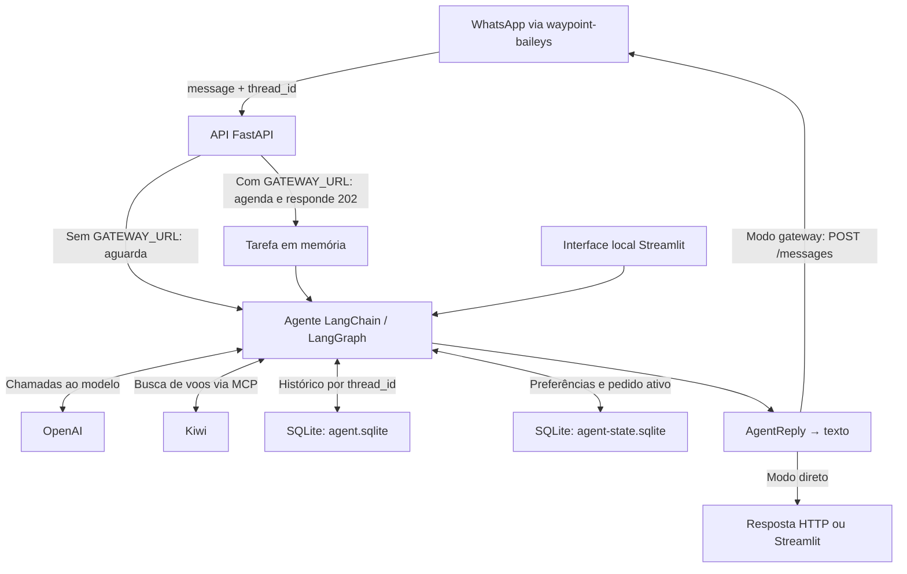

# travel-agent

[**English**](README.md) | **Português (Brasil)**

Assistente de busca de voos para conversas no WhatsApp. O Dhay consulta a Kiwi, compara ofertas e responde com preço, rota e link de compra, mantendo o contexto de cada conversa em SQLite.

Este repositório contém o serviço do agente e uma interface local em Streamlit. A conexão com o WhatsApp fica em um serviço separado, `waypoint-baileys`. As respostas do agente são orientadas por um prompt em português brasileiro; a interface local mistura rótulos em inglês e português. A documentação em inglês não altera o idioma do produto.

[Primeiro uso](#primeiro-uso) · [Integração com WhatsApp](#integração-com-whatsapp) · [Configuração](#configuração) · [Como funciona](#como-funciona) · [Dados e operação](#dados-e-operação) · [Desenvolvimento e verificação](#desenvolvimento-e-verificação)

## O que faz

- Busca voos de ida ou ida e volta, com datas fixas, intervalos ou duração da estadia.
- Apresenta ofertas com preço, rota, detalhes e link da Kiwi.
- Mantém preferências e o pedido ativo por `thread_id`, além do histórico da conversa.
- Normaliza destinos conhecidos, como Bali e Santiago, e filtra chegadas incompatíveis nos casos cobertos pelo resolvedor.
- Atende por HTTP diretamente ou devolve a resposta ao gateway do WhatsApp em segundo plano.

**Limites:** a compra acontece fora da conversa, no link da oferta. O agente não reserva, emite passagens, cobra, monitora preços nem oferece hotéis, vistos ou pacotes. Resultados dependem da Kiwi e do modelo; esta é uma prova de conceito, não uma garantia de disponibilidade ou preço.

## Primeiro uso

### Pré-requisitos

- Python **3.13 ou superior** e [uv](https://docs.astral.sh/uv/).
- Uma chave de API da OpenAI com acesso ao modelo configurado; chamadas ao modelo podem gerar cobrança.
- Acesso de rede à OpenAI e a `https://mcp.kiwi.com`. O serviço descobre as ferramentas MCP da Kiwi durante a inicialização, antes de aceitar requisições.

Os comandos abaixo executam o código-fonte a partir da raiz deste repositório.

### 1. Instalar e configurar

```bash
uv sync
cp .env.example .env
```

Copie o arquivo somente se ainda não tiver um `.env`. Edite-o antes de iniciar:

- Preencha `OPENAI_API_KEY`.
- Deixe `GATEWAY_URL=` vazio para testar sem WhatsApp. O exemplo vem com `http://localhost:3000`, que ativa o modo de resposta pelo gateway.
- Troque `GATEWAY_TOKEN=change-me` por um segredo próprio. Não use os tokens de exemplo em um serviço exposto.
- Troque `ADMIN_TOKEN` se precisar apagar conversas pela API; deixe-o vazio para desabilitar essa operação.

### 2. Iniciar a API

```bash
uv run fastapi dev main.py
```

A API fica em `http://127.0.0.1:8000`; a documentação interativa, em `http://127.0.0.1:8000/docs`. Use **Ctrl+C** para parar.

### 3. Enviar a primeira mensagem

Em outro terminal, defina `GATEWAY_TOKEN` com o mesmo valor do `.env` — o `curl` não carrega esse arquivo automaticamente:

```bash
export GATEWAY_TOKEN='replace-with-your-token'
curl --fail-with-body http://127.0.0.1:8000/v1/messages \
  -H "Authorization: Bearer $GATEWAY_TOKEN" \
  -H 'Content-Type: application/json' \
  -d '{"message":"Quero ir de São Paulo, Brasil, a Santiago, Chile, no próximo mês, ficar 7 noites, 1 adulto, econômica. Busque a opção mais barata.","thread_id":"readme-demo"}'
```

Com `GATEWAY_URL` vazio, a resposta HTTP é `200`, com `{"messages":"..."}`; `messages` é texto, não uma lista. O agente pode apresentar ofertas ou pedir um detalhe que faltar. Reutilize `readme-demo` para continuar a conversa e use outro `thread_id` para separar o histórico. Aguarde as chamadas ao modelo e às ferramentas; a resposta não é transmitida em streaming.

### Interface local opcional

```bash
uv run streamlit run app.py
```

Abra a URL indicada pelo Streamlit, normalmente `http://localhost:8501`. Em **Travel Assistant** (assistente de viagens), use **Digite sua pergunta**; **Consultando o agente...** indica que a resposta está sendo processada. A interface chama o agente diretamente, sem passar pela API ou pelo gateway. Cada sessão do Streamlit recebe um `thread_id` aleatório; uma nova sessão não recupera automaticamente a conversa anterior. Pare com **Ctrl+C**.

## Integração com WhatsApp

Configure `GATEWAY_URL` com a URL do serviço `waypoint-baileys` e use o mesmo `GATEWAY_TOKEN` nos dois serviços.

| Etapa | Contrato |
| --- | --- |
| Entrada do gateway | `POST /v1/messages` com `{"message":"...","thread_id":"<JID do chat>"}` |
| Aceite do agente | HTTP `202` com `{"ok":true}` quando `GATEWAY_URL` está preenchido |
| Resposta ao gateway | `POST {GATEWAY_URL}/messages` com `{"jid":"<JID do chat>","text":"..."}` |
| Autenticação | `Authorization: Bearer <GATEWAY_TOKEN>` em ambas as direções |

Um `202` confirma apenas o agendamento local, **não a entrega**. As tarefas ficam na memória do processo, sem fila durável; reiniciar o serviço pode perder trabalho pendente. O modo gateway serializa mensagens por conversa dentro de um único processo. Erros do agente geram uma mensagem de fallback; falhas de entrega são registradas nos logs. O cliente tenta novamente uma vez em erros HTTP de transporte ou em uma primeira resposta `503`.

**Segurança:** sem `GATEWAY_TOKEN`, `/v1/messages` fica aberto. O token é compartilhado entre serviços, não uma autorização individual por `thread_id`; mantenha a API atrás de uma fronteira confiável. `/` e `/docs` não são protegidos por esse middleware. O endpoint administrativo usa um token separado.

## Configuração

As configurações são lidas do ambiente e do `.env`; variáveis do ambiente têm precedência. Reinicie o processo após alterá-las.

| Variável | Padrão no código | Uso |
| --- | --- | --- |
| `OPENAI_API_KEY` | vazio | Credencial para chamadas à OpenAI |
| `OPENAI_MODEL` | `gpt-5-mini` | Modelo do agente |
| `OPENAI_REASONING_EFFORT` | `low` | Esforço de raciocínio; valores aceitos dependem do modelo |
| `OPENAI_VERBOSITY` | `low` | Verbosidade; compatibilidade depende do modelo |
| `GATEWAY_URL` | vazio | Vazio: resposta HTTP direta; preenchido: entrega pelo gateway |
| `GATEWAY_TOKEN` | vazio | Segredo compartilhado de entrada e saída do gateway |
| `ADMIN_TOKEN` | vazio | Autoriza exclusão de conversas; vazio: endpoint recusa |
| `TIMEZONE` | `America/Sao_Paulo` | Data atual e interpretação de datas relativas no prompt |
| `SQLITE_PATH` | `data/agent.sqlite` | Banco do histórico LangGraph; também determina o caminho do banco de estado |

O [`.env.example`](.env.example) define uma URL de gateway e tokens de exemplo, ao contrário dos padrões vazios do código.

## Como funciona



As chamadas externas ao modelo e à Kiwi determinam boa parte do tempo de resposta. A busca normaliza até cinco ofertas para o agente; o prompt orienta a resposta final a apresentar até três. Os bancos ficam separados para reduzir contenção entre o checkpointer assíncrono e as gravações síncronas de estado.

| Código | Responsabilidade |
| --- | --- |
| [`main.py`](main.py) / [`app.py`](app.py) | Entradas FastAPI e Streamlit |
| [`travel_agent/api/`](travel_agent/api/) | Rotas HTTP e autenticação |
| [`travel_agent/services/`](travel_agent/services/) | Execução do agente e envio ao gateway |
| [`travel_agent/agent/builder.py`](travel_agent/agent/builder.py) | Modelo, descoberta MCP, ferramentas e middleware |
| [`travel_agent/agent/tools/search.py`](travel_agent/agent/tools/search.py) | Busca Kiwi, normalização e filtro de destino |
| [`travel_agent/agent/reply.py`](travel_agent/agent/reply.py) | Resposta estruturada e renderização do texto |
| [`travel_agent/agent/memory.py`](travel_agent/agent/memory.py) | Histórico, preferências e pedido ativo (`TripBrief`) |
| [`travel_agent/settings.py`](travel_agent/settings.py) | Configuração por ambiente |

## Dados e operação

- **Persistência:** `SQLITE_PATH` guarda os checkpoints LangGraph. Preferências e pedido ativo ficam no arquivo irmão `<nome>-state.sqlite`; por padrão, `data/agent-state.sqlite`. Caminhos relativos usam o diretório de execução. Reiniciar o serviço não apaga esses arquivos.
- **Privacidade:** conteúdo da conversa e contexto são enviados ao modelo; critérios de busca são enviados à Kiwi. A API registra o `thread_id` e os primeiros 80 caracteres da mensagem recebida; falhas de entrega também podem registrar a resposta. Trate bancos e logs como dados sensíveis.
- **Deploy:** no Railway, execute este serviço separadamente do gateway. Use a rede privada em `GATEWAY_URL`, por exemplo `http://<gateway>.railway.internal:<porta>`, e monte um volume em `data/` (ou no diretório configurado) para persistir ambos os bancos entre deploys. O servidor de desenvolvimento não é o comando de produção; use `uv run fastapi run main.py --host 0.0.0.0 --port "$PORT"`, com `PORT` definido pela plataforma.

### Apagar uma conversa de teste

A operação abaixo apaga preferências, pedido ativo e histórico LangGraph da conversa; não apaga logs nem mensagens no WhatsApp. Aguarde o término das mensagens em processamento antes de usá-la.

```bash
export ADMIN_TOKEN='replace-with-your-admin-token'
curl --fail-with-body -X DELETE \
  'http://127.0.0.1:8000/v1/admin/threads/readme-demo' \
  -H "Authorization: Bearer $ADMIN_TOKEN"
```

Use o mesmo token configurado no servidor. Para um chat do WhatsApp, substitua `readme-demo` pelo JID usado em `POST /v1/messages`, por exemplo `5511999999999%40s.whatsapp.net` (`@` codificado na URL). Token ausente, incorreto ou não configurado resulta em `401`. Uma conversa inexistente também retorna `200`, com `{"ok":true,"thread_id":"..."}`.

## Desenvolvimento e verificação

```bash
uv run pytest
```

A suíte existente cobre memória e exclusão por conversa, autenticação administrativa, normalização de destinos, adaptação de resultados Kiwi, renderização de ofertas e proteções após buscas. Usa dados locais e substitutos de ferramentas; não comprova chamadas reais à OpenAI/Kiwi, qualidade das ofertas nem entrega pelo WhatsApp.

Para uma verificação ponta a ponta, inicie a API e envie a mensagem do primeiro uso; depois teste separadamente o fluxo de `202` e retorno ao gateway. Isso requer credenciais, conectividade e, para WhatsApp, o gateway em execução. Não há capturas de tela do produto incluídas; a interface Streamlit é opcional e não substitui a validação da integração.
